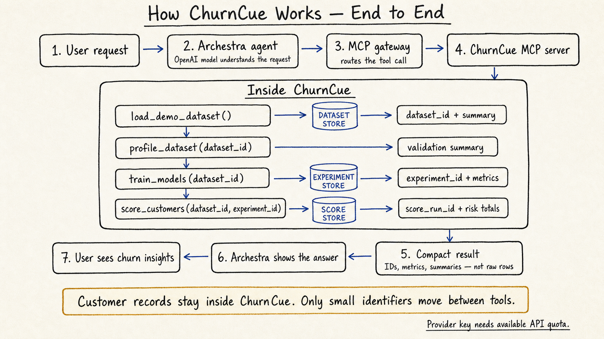
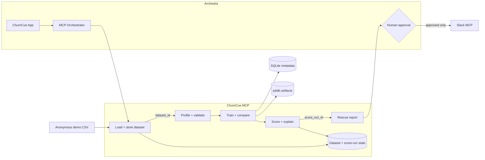

<div align="center">
  

  # ChurnCue

  **Know who may leave. Understand the signal. Protect the renewal.**

  Production-oriented customer-retention intelligence for Archestra, powered by deterministic machine learning over MCP.

  [](https://github.com/Bhaktabahadurthapa/ChurnCue/actions/workflows/ci.yml)
  [](https://github.com/Bhaktabahadurthapa/ChurnCue/actions/workflows/codeql.yml)
  [](https://www.python.org/)
  [](https://modelcontextprotocol.io/)
  [](Dockerfile)
  [](LICENSE)

  [Quickstart](#quickstart) · [Architecture](docs/ARCHITECTURE.md) · [Archestra setup](docs/ARCHESTRA_SETUP.md) · [App prompt](docs/ARCHESTRA_APP_PROMPT.md) · [Demo script](docs/DEMO_SCRIPT.md)
</div>


## The Monday-morning problem

Customer-success teams repeatedly need to answer five questions before renewal risk becomes lost revenue:

1. Which customers are likely to cancel?
2. Who became riskier this week?
3. Which observed signals explain the change?
4. How much recurring revenue is exposed?
5. What action should the team take next?

ChurnCue converts anonymous customer-health records into a prioritized, evidence-backed rescue queue. It keeps model calculations in deterministic Python services and keeps outbound Slack notifications behind explicit human approval.

## Why ChurnCue

| Capability | What it delivers |
|---|---|
| Deterministic ML | All metrics and probabilities come from scikit-learn—not the LLM. |
| Weekly movement | Compares current probability with prior risk and identifies newly-at-risk accounts. |
| Revenue prioritization | Quantifies probability-weighted monthly and annual revenue exposure. |
| Evidence, not guesswork | Returns stable reason codes from observed product, payment, support, login, renewal, and satisfaction signals. |
| Governed operations | Generates a Slack-ready preview but never sends an external message. |
| Production boundaries | Validated input limits, PII rejection, safe artifact resolution, structured logs, health checks, and non-root containers. |

## System architecture

<div align="center">
  
  <p><em>Customer records stay inside ChurnCue while compact identifiers move safely between MCP tools.</em></p>
</div>



**Archestra** is the authenticated application interface and MCP orchestrator. **ChurnCue MCP** stores demo rows internally and exposes only compact dataset and score-run identifiers to the model. **Slack MCP** receives only messages that a human approves.

## Weekly review flow

```text
Load demo → dataset_id → Profile quality → Train 3 models → experiment_id
          → Score customers → score_run_id → Compare risk → Rescue report
          → Preview Slack message → Human approval → Slack MCP sends
```

## Quickstart

### Run locally

```bash
git clone https://github.com/Bhaktabahadurthapa/ChurnCue.git
cd ChurnCue
python3.12 -m venv .venv
source .venv/bin/activate
pip install -e '.[dev]'
python scripts/generate_demo_data.py
churncue
```

Verify the service:

```bash
curl http://localhost:8000/health
npx -y @modelcontextprotocol/inspector
```

Connect the Inspector to `http://localhost:8000/mcp` with **Streamable HTTP**.

### Run with Docker

```bash
docker compose up --build -d
docker compose ps
curl http://localhost:8000/health
```

Stop the service with `docker compose down`. SQLite metadata and model artifacts remain in named volumes.

## Connect to Archestra

Register a remote Streamable HTTP server in Archestra's Private MCP Registry:

```text
Name: ChurnCue
URL:  http://host.docker.internal:8000/mcp
```

Linux-hosted Archestra containers may need `host.docker.internal:host-gateway`. Assign all eight tools to the app, then paste [the ready-to-use application prompt](docs/ARCHESTRA_APP_PROMPT.md) into Archestra Chat.

## MCP tool surface

| Tool | Responsibility | Key output |
|---|---|---|
| `health_check` | Runtime readiness | Name, version, transport, timestamp |
| `load_demo_dataset` | Store bounded anonymous demo data | Dataset ID, count, compact summary |
| `profile_dataset` | Schema and quality analysis | Types, missing values, duplicates, summaries |
| `train_models` | Reproducible model evaluation | Metrics, confusion matrices, recommended model |
| `score_customers` | Score a dataset by ID | Score-run ID, totals, top-risk preview |
| `compare_weekly_risk` | Compare a score run by ID | Movement totals and top-change preview |
| `explain_risk` | Deterministic reason codes | Evidence and non-causality statement |
| `generate_rescue_report` | Operational prioritization | Totals, priority queue, Slack-ready preview |

Recommended call order:

```text
load_demo_dataset → dataset_id → profile_dataset + train_models
dataset_id + experiment_id → score_customers → score_run_id
score_run_id → compare_weekly_risk + explain_risk + generate_rescue_report
```

## Machine-learning pipeline

| Stage | Implementation |
|---|---|
| Validation | Binary target, both classes, minimum sample size, bounded scalar records |
| Leakage control | Drops `customer_id`, target, and prediction-derived fields |
| Missing values | Median imputation for numeric; most-frequent imputation for categorical |
| Encoding | Standard scaling and unknown-safe one-hot encoding |
| Evaluation | Fixed 80/20 stratified split with random state 42 |
| Models | Logistic Regression, Random Forest, Gradient Boosting |
| Metrics | Accuracy, precision, recall, F1, ROC-AUC, confusion matrix |
| Selection | Highest ROC-AUC with F1 as the tie-breaker |
| Persistence | Complete pipeline in joblib; immutable experiment metadata in SQLite |

The included dataset contains 50 reproducible synthetic customers and no real personal data.

## Configuration

All runtime variables use the `CHURNCUE_` prefix. Safe defaults are documented in [.env.example](.env.example).

| Variable | Default | Purpose |
|---|---:|---|
| `CHURNCUE_HOST` | `0.0.0.0` | Container listener address |
| `CHURNCUE_PORT` | `8000` | MCP and health port |
| `CHURNCUE_DATABASE_PATH` | `data/churncue.db` | Experiment metadata database |
| `CHURNCUE_ARTIFACT_DIR` | `data/artifacts` | Trusted model artifact directory |
| `CHURNCUE_DEMO_DATA_PATH` | `data/demo/customer_churn_demo.csv` | Packaged demo source |
| `CHURNCUE_MAX_INPUT_ROWS` | `5000` | Maximum MCP input records |
| `CHURNCUE_MAX_DEMO_ROWS` | `50` | Maximum records stored in one demo dataset |
| `CHURNCUE_MAX_STRING_LENGTH` | `200` | Scalar string boundary |
| `CHURNCUE_RANDOM_STATE` | `42` | Reproducible ML seed |
| `CHURNCUE_PUBLISHED_PORT` | `8000` | Optional Compose host-port override |

No API keys or customer credentials belong in this repository.

## Security and privacy

- Anonymous `CUST-*` identifiers only; common PII fields are rejected at the MCP boundary.
- Dataset and score rows stay inside the ChurnCue process; MCP calls use opaque identifiers.
- Row, field, string, probability, and schema limits defend resource boundaries.
- Experiment IDs resolve only to service-created artifacts below the configured directory.
- The service performs no arbitrary code execution, arbitrary path reads, browser fetches, or outbound messages.
- Containers run as UID/GID `10001`, drop Linux capabilities, and enable `no-new-privileges`.
- Production deployments should terminate authenticated TLS at Archestra or a trusted gateway.

Review [SECURITY.md](SECURITY.md) before production use or vulnerability reporting.

## Repository layout

```text
.
├── assets/brand/          # Repository identity and hero artwork
├── data/demo/             # Reproducible anonymous dataset
├── data/artifacts/        # Runtime model pipelines (ignored)
├── docs/                  # Archestra, architecture, and demo guides
├── scripts/               # Demo-data generation
├── src/churncue/          # MCP server and deterministic business logic
├── tests/                 # Core behavior and boundary coverage
├── Dockerfile
├── docker-compose.yml
└── pyproject.toml
```

## Engineering quality

```bash
ruff check .
ruff format --check .
pytest
```

The test configuration enforces at least 80% core coverage. CI runs linting, formatting, tests, package installation, and a container build on every pull request.

## Documentation

| Guide | Audience |
|---|---|
| [Architecture](docs/ARCHITECTURE.md) | Engineers and security reviewers |
| [Archestra setup](docs/ARCHESTRA_SETUP.md) | Operators connecting MCP services |
| [Archestra app prompt](docs/ARCHESTRA_APP_PROMPT.md) | App builders generating the interface |
| [Three-minute demo](docs/DEMO_SCRIPT.md) | Hackathon presenters |
| [Contributing](CONTRIBUTING.md) | Contributors and maintainers |
| [Security](SECURITY.md) | Vulnerability reporters and operators |

## Demo and screenshots

The repository includes the complete [sub-three-minute demo runbook](docs/DEMO_SCRIPT.md). Add the final public video URL and Archestra screenshots here after recording; no mock browser results are presented as real product output.

## Known limitations

- Synthetic training data demonstrates the workflow; it is not a production churn policy.
- Threshold reason codes are operational signals, not causal or SHAP explanations.
- SQLite and local artifacts target a single service instance.
- Risk thresholds are fixed product rules and should be calibrated before production use.
- Authentication, authorization, TLS, Sheets access, and Slack delivery are external deployment responsibilities.

## Roadmap

- Time-aware evaluation, probability calibration, and drift monitoring
- Managed metadata storage and object-backed model artifacts
- Tenant-aware authorization and intervention audit events
- Feedback-driven retraining and intervention outcome measurement
- Published container releases with signed provenance and SBOMs

## Contributing and license

Contributions are welcome. Read [CONTRIBUTING.md](CONTRIBUTING.md), follow the [Code of Conduct](CODE_OF_CONDUCT.md), and use the issue templates for reproducible reports.

ChurnCue is available under the [MIT License](LICENSE).

---

<div align="center">
  Built for the Archestra Apps Hackathon with Python, scikit-learn, FastMCP, and human judgment.
</div>
