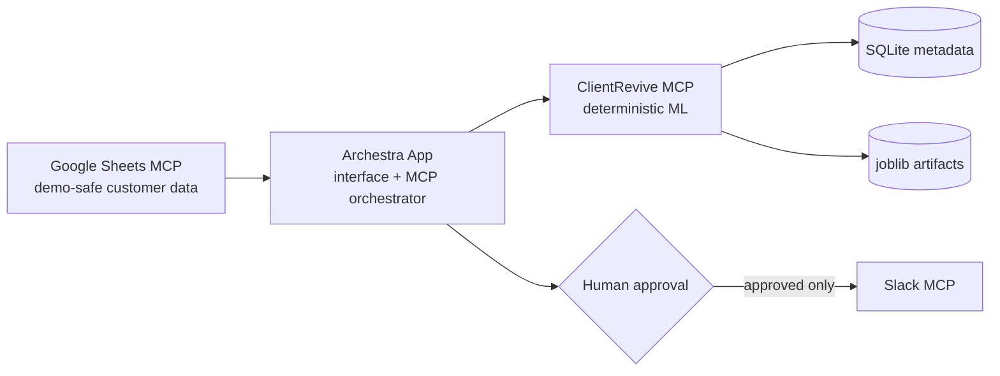

# ChurnCue — ClientRevive Ops

ClientRevive Ops is a production-oriented hackathon service that helps customer-success teams identify renewal risk every Monday. Archestra supplies the application interface and MCP orchestration; this server supplies deterministic profiling, model training, scoring, explanations, and reporting.

## Problem and real business scenario

Customer-success managers need one reliable view of who may cancel, what changed, why the account is flagged, and how much revenue is exposed. Spreadsheet review is slow and inconsistent. ClientRevive turns demo-safe customer data into a review queue while keeping outbound Slack communication behind explicit human approval.

## Solution and features

- 500 reproducible anonymous customers with behaviorally plausible churn relationships
- Logistic Regression, Random Forest, and Gradient Boosting evaluated by scikit-learn
- ROC-AUC recommendation with F1 tie-break; accuracy, precision, recall, F1, ROC-AUC, and confusion matrices
- Leakage-safe preprocessing, missing-value imputation, one-hot encoding, and stratified evaluation
- Persisted joblib pipelines and SQLite experiment metadata
- Probability-based risk tiers, weekly movement, revenue at risk, evidence-based reason codes, and a Slack-ready preview
- Eight validated FastMCP tools over stateless Streamable HTTP
- Non-root Docker runtime, health check, persistent state, tests, coverage, and linting

## Architecture



MCP is the typed boundary that lets Archestra invoke real tools instead of inventing browser-side results. ClientRevive never fetches Sheets and never sends Slack messages itself.

## Technology

Python 3.12, official MCP Python SDK/FastMCP 1.28.1, pandas, NumPy, scikit-learn, Pydantic, joblib, SQLite, pytest, ruff, Docker, and Compose. The MIT License permits broad reuse.

## Project structure

```text
src/clientrevive/       MCP server and business logic
scripts/                reproducible demo-data generator
data/demo/              anonymous generated CSV
data/artifacts/         runtime model pipelines (ignored)
tests/                  unit and integration-focused tests
docs/                   architecture, Archestra setup/prompt, and demo script
```

## Local setup

```bash
git clone https://github.com/Bhaktabahadurthapa/ChurnCue.git
cd ChurnCue
python3.12 -m venv .venv
source .venv/bin/activate
pip install -e '.[dev]'
python scripts/generate_demo_data.py
clientrevive
```

The MCP URL is `http://localhost:8000/mcp`; the container health probe is `http://localhost:8000/health`. Test with `npx -y @modelcontextprotocol/inspector` and select Streamable HTTP.

## Docker setup

```bash
docker compose up --build
docker compose ps
curl http://localhost:8000/health
```

From Archestra in Docker, register `http://host.docker.internal:8000/mcp`. On Linux, `extra_hosts: ["host.docker.internal:host-gateway"]` may be needed on the Archestra container; this project already applies it to its own service.

## Environment variables

All variables use the `CLIENTREVIVE_` prefix. See `.env.example`. Key settings are `HOST`, `PORT`, `DATABASE_PATH`, `ARTIFACT_DIR`, `DEMO_DATA_PATH`, `MAX_INPUT_ROWS`, `MAX_DEMO_ROWS`, `MAX_STRING_LENGTH`, `RANDOM_STATE`, and `LOG_LEVEL`. No API credentials are accepted or stored.

## MCP tools

| Tool | Purpose |
|---|---|
| `health_check` | Service/version/transport health |
| `load_demo_dataset` | Read up to 500 demo rows |
| `profile_dataset` | Quality, schema, distributions, and summaries |
| `train_models` | Train/evaluate all models and persist the winner |
| `score_customers` | Return probability, tier, revenue exposure, and signals |
| `compare_weekly_risk` | Compare current probability to `previous_risk` |
| `explain_risk` | Return deterministic non-causal reason codes |
| `generate_rescue_report` | Aggregate the queue and prepare—not send—a Slack message |

Typical order: load rows → profile → train → score (use returned `experiment_id`) → compare → report. See [Archestra setup](docs/ARCHESTRA_SETUP.md) and the [paste-ready app prompt](docs/ARCHESTRA_APP_PROMPT.md).

## Testing

```bash
ruff check .
ruff format --check .
pytest
# or: make check
```

## Security and privacy

The demo contains anonymous IDs only—no names, email addresses, phone numbers, or real data. Inputs have row, field, and string limits. Model identifiers resolve through SQLite to the configured artifact directory, blocking arbitrary paths. The service does not execute supplied code, log rows or secrets, call external services, or send Slack messages. Binding `0.0.0.0` is required for Docker; expose it only on a trusted network and add gateway authentication/TLS for production.

## Screenshots and demo video

- Screenshot placeholder: Archestra weekly review dashboard
- Screenshot placeholder: customer evidence and approval dialog
- Demo video placeholder: add the final sub-three-minute recording URL

## Known limitations

The synthetic model is a demonstration, not a production churn policy. Threshold explanations are operational signals rather than SHAP/local causal explanations. SQLite and local artifacts suit a single service instance. Authentication and TLS are expected at the Archestra/gateway or deployment layer. Risk thresholds are fixed product rules.

## Roadmap

Add drift monitoring, calibrated thresholds, time-aware evaluation, object storage, a managed metadata database, tenant-aware authorization, audit events for interventions, and feedback-driven retraining.

## Hackathon submission

This project demonstrates the division of responsibility central to the Archestra Apps Hackathon: Archestra generates and hosts the human workflow, MCP connects governed capabilities, Google Sheets supplies demo-safe records, ClientRevive computes every ML result deterministically, and Slack receives only approved communications. Follow the [three-minute demo](docs/DEMO_SCRIPT.md).
